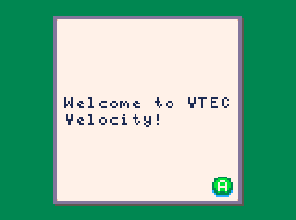
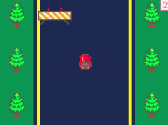

# VTEC Velocity

Welcome to **VTEC Velocity**, a retro-style racing game for the Adafruit PyBadge! Test your reflexes, avoid obstacles, and score as high as possible as you race down the road.

## Features
- **Dynamic gameplay**: Avoid trees and barricades while staying within the road boundaries.
- **Speed increases**: Every 75 points, the game speeds up to keep you on your toes.
- **Game over animation**: A melody plays when you crash, and your final score is displayed.

## How to Play

1. **Objective**: Move your car left and right to avoid obstacles and score points. 
2. **Controls**:
   - Use the **D-pad** to steer your car.
   - Stay within the road boundaries.
3. **Scoring**:
   - Points increase automatically every 150 milliseconds.
   - Speed increases after every 75 points.
4. **Game Over**: The game ends when your car collides with a barricade. A melody plays, and your final score is displayed.

## How to Play in MakeCode Arcade
1. Download the precompiled `.uf2` file: [arcade-VTEC-Velocity.uf2](asset_files/arcade-VTEC-Velocity.uf2).
2. Connect your Adafruit PyBadge to your computer via USB.
3. Put your PyBadge in bootloader mode:
   - Press the reset button twice quickly. The device should appear as a USB drive.
4. Copy the `arcade-VTEC-Velocity.uf2` file to the PyBadge USB drive.
5. Once the transfer is complete, the PyBadge will reboot, and you can start playing **VTEC Velocity**!

---

Have fun playing **VTEC Velocity**! Feedback and contributions are welcome. 🚗💨

 